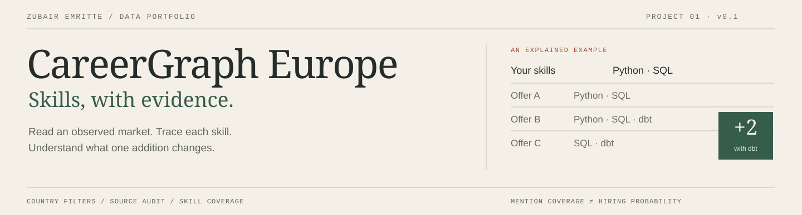

<picture>
  <source media="(max-width: 680px)" srcset="assets/hero-compact.svg">
  
</picture>

# CareerGraph Europe

**Skills, with evidence.** A country-configurable application for exploring observed job offers and deciding which skill to investigate next.

Built by [Zubair Emritte](https://github.com/zubairemritte).

[Start here](docs/quickstart.md) · [Methodology](docs/methodology.md) · [Sources & coverage](docs/sources.md) · [Read the code](docs/code-guide.md) · [Release evidence](docs/release-0.2.md)

## The question

“Given my current skills and a specific offer sample, which additional skill would complete the detected skill set of the most offers?”

CareerGraph makes that calculation inspectable. Select a country and role, see skill mentions and their denominators, then open the offers behind a suggested addition. Official economic statistics provide a separate layer of context.

The project combines labour-market analysis, data-quality controls, SQL modelling and an explainable product. It does not assign a hiring probability or rank candidates.

## What works in 0.2

- **16 configured countries:** country is an ISO alpha-2 parameter, separate from the connector. No country is hard-coded into the analytical formulas.
- **A real collection path:** JobTech / Arbetsförmedlingen → validation → deduplication → SQLite → FastAPI → an English web interface.
- **Official European context:** a Eurostat connector and a dated, attributed snapshot of quarterly vacancy rates.
- **Traceable skill mentions:** 24 curated skills, versioned aliases and evidence excerpts; a conservative title-based role classifier.
- **One-skill analysis:** inspect how many additional offers become fully covered with respect to their detected skill mentions.
- **Skill relationships:** co-occurrence counts and Jaccard similarity, with minimum support.
- **Visible data quality:** collection scope, timestamps, rejected records, duplicate counts, query caps, source hashes and preserved successful snapshots.
- **Readable engineering:** documented, typed functions; provider classes, an injectable connector protocol and a collection service with explicit responsibilities.
- **Reproducibility:** Poetry, exact direct versions, a committed `poetry.lock`, strict static type checks and small fixture checks in CI.

### Coverage, without assumptions

| Layer | Available in this release |
| --- | --- |
| Country filters | 16 European markets selected by ISO alpha-2 code; [country catalog](careergraph/config/countries.json) |
| Demo offers | 768 deliberately fictional offers across all 16 countries; generated locally |
| Actual offers | Verified JobTech connector for workplaces in Sweden; first successful collection recorded in the release report |
| Official context | Eurostat `jvs_q_r21`, with missing country/quarter values preserved rather than invented |
| Other countries' offer feeds | Not connected yet; the UI explicitly says so |

**A country selector is not a claim of live market coverage.** Synthetic offers and collected offers never share an analytical cohort. Eurostat's economy-wide rate is never treated as a data-job vacancy rate.

## Run locally

Use Python 3.12, Git and Poetry 2.5.1. The commands below work from the repository root. [Installation on Windows, macOS and Linux](docs/quickstart.md).

```bash
git clone https://github.com/zubairemritte/careergraph-europe.git
cd careergraph-europe
poetry env use 3.12
poetry sync
poetry run pytest -q tests/test_smoke.py
```

The smoke checks use tiny temporary fixtures and no public API. To explore the full offline application on your own machine:

```bash
poetry run careergraph demo
poetry run careergraph benchmark --from-file examples/eurostat-context.json
poetry run careergraph serve
```

Open **http://127.0.0.1:8000**. The default offer dataset is labelled **Illustrative demo**. The official context panel is based on the separately attributed Eurostat snapshot.

Poetry manages `.venv`; manual activation is unnecessary. The [quickstart](docs/quickstart.md) explains expected results and troubleshooting.

### Collect actual data

```bash
poetry run careergraph collect --source jobtech --country SE --query "data analyst" --pages 1
poetry run careergraph benchmark
```

Then choose **Collected offers** in the interface. These commands use public, documented sources without credentials. Requests are bounded; publication is an explicit operation, not a background scrape.

```bash
poetry run careergraph inspect --mode live --country SE --role data_analyst --skills python,sql
poetry run careergraph coverage
poetry run mypy
poetry run ruff check careergraph tests scripts
```

## Follow one result

Suppose your skills are Python and SQL:

| Offer | Detected skill mentions | Covered now? | After adding dbt? |
| --- | --- | --- | --- |
| A | Python, SQL | Yes | Yes |
| B | Python, SQL, dbt | No | Yes |
| C | SQL, dbt | No | Yes |
| D | Python, Docker, AWS | No | No |
| E | None detected | Excluded | Excluded |

The baseline is **1 of 4 eligible offers**. Adding dbt covers **2 additional offers** in this example. It says nothing about a candidate's experience, language level, ability to do the job or probability of being hired. [Read the full calculation](docs/methodology.md).

## Engineering decisions

The first release uses **Python, SQL, SQLite, FastAPI and browser-native HTML/CSS/JavaScript**. Keeping the operational footprint small makes the pipeline easy to run, inspect and test. Country coverage and source access are harder problems than adding infrastructure, so those constraints are explicit in the model.

The collector stores successful dated samples. A failed run cannot replace the last successful one. The application exposes read-only endpoints; collection stays in the CLI. No CV file is uploaded or retained.

The [architecture note](docs/architecture.md) explains the current limits and the conditions that would justify a warehouse or scheduler. Tools that are not implemented are not listed as completed capabilities.

## Read the project

| To understand… | Read… |
| --- | --- |
| The product and its release boundary | [Product brief](docs/product.md) |
| How to run and explore it | [Quickstart](docs/quickstart.md) |
| Denominators, formulas and interpretation | [Methodology](docs/methodology.md) |
| Why a source is used or deferred | [Source register](docs/sources.md) |
| Tables, fields and processing rules | [Data contract](docs/data-contract.md) |
| Reliability and recovery | [Operations](docs/operations.md) |
| What was actually verified | [Release 0.2 checks](docs/release-0.2.md) and [0.1 collection evidence](docs/release-0.1.md) |
| Trade-offs | [Architecture decisions](docs/decisions.md) |

**Status:** working local first release, not a production service or a complete European job database. Extraction is a transparent baseline; the authored regression set is not evidence of general accuracy on multilingual advertisements.

## Data attribution

Job advertisements: [Arbetsförmedlingen open data / JobSearch](https://data.arbetsformedlingen.se/dataservice/jobsearch/) (CC0). No live advertisement bodies are committed here.

Official statistics: [Eurostat, `jvs_q_r21`](https://ec.europa.eu/eurostat/databrowser/view/jvs_q_r21/default/table), retrieved 7 October 2026 for the included snapshot. Selected and reshaped by CareerGraph Europe; Eurostat is not responsible for this analysis. [Reuse notice and source limitations](docs/sources.md).

Third-party data retains its own source terms. Attribution and permitted use are documented separately from the application code.
