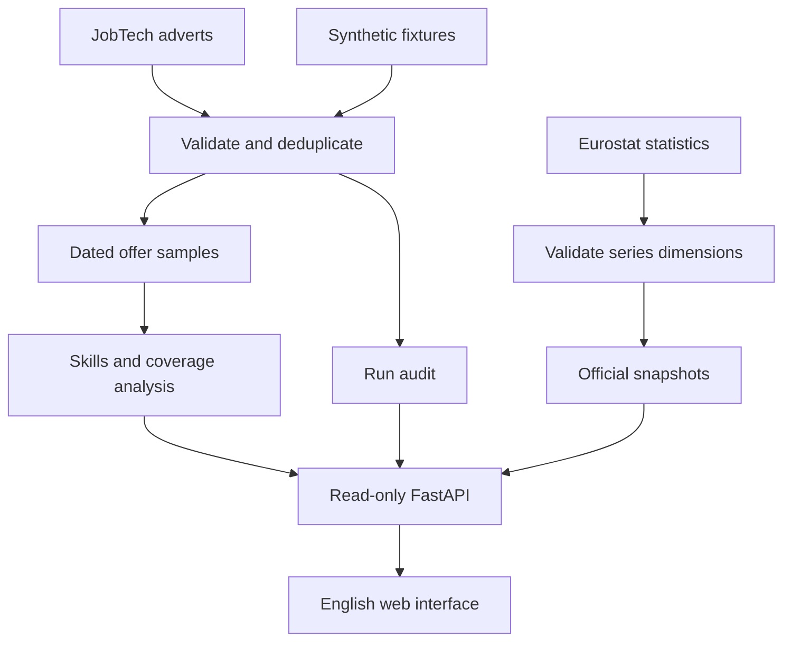

# Architecture

## Two analytical layers, one interface

Synthetic and live runs have different mode identifiers and cannot form a mixed cohort. The official-statistics table is never joined to adverts to infer skill demand or hiring likelihood.

## Components

| Location | Responsibility |
| --- | --- |
| `config/countries.json` | Supported ISO alpha-2 filter values and English names |
| `config/skills.json` | Versioned local skill IDs, labels and aliases |
| `config/roles.json` | Ordered title-alias rules; unclassified fallback |
| `http.py` | Bounded GET requests, retry policy, timeouts, safe error messages |
| `connectors.py` | Provider-specific normalization and JSON-stat decoding |
| `models.py` | Typed offer contract and field validation |
| `contracts.py` | Typed evidence, catalog and benchmark structures; injectable connector protocol and collection batch |
| `pipeline.py` | Run lifecycle, validation, duplicate handling, atomic snapshot commit |
| `sql/schema.sql` | Relational tables, constraints and indexes |
| `text.py` | Sanitization, role classification and evidence spans |
| `analysis.py` | Cohort selection, metrics, evidence drill-down and coverage ledger |
| `api.py` | Read-only endpoints, parameter validation and static UI |
| `static/` | Browser-native interface; no third-party UI framework or tracking |
| `demo.py` | Deterministic synthetic fixture generator |
| `evaluation.py` | Auditable mention-extraction regression evaluation |

Paths in this table are relative to `careergraph/`.

Version 0.2 uses `JobTechConnector` and `EurostatConnector` for provider-specific state and an injectable transport. `CollectionService` owns the local database target and advert run lifecycle. Analytical formulas remain pure functions. The [code guide](code-guide.md) explains each class, typed boundary and the requirements for an additional verified source.

## Storage and consistency

SQLite is the first-release persistence layer. It provides transactions, foreign keys, a unique duplicate fingerprint per run and inspectable SQL without a database service. Each request uses its own connection. Write-ahead logging reduces interference between a collector and a reader.

Collection starts a visible `running` run record. Retrieved adverts are validated and inserted inside one transaction. Only the completed transaction sets that run to `success`. A handled collection failure creates a `failed` report; partial offer inserts are rolled back. Analysis ignores running and failed runs.

The latest successful run is selected per source/country. A new empty successful search really can replace the current sample with zero offers; this is intentional and distinguishable from a failed refresh. Older snapshots remain available in SQL.

Source payload hashes identify the canonical JSON observed. The application does not archive original raw response bodies, so a hash alone cannot reconstruct a provider response. Normalized observations and collection metadata support inspection; the deterministic fixture and the bundled statistics snapshot support offline reproducibility.

## API surface

| Endpoint | Purpose |
| --- | --- |
| `GET /health` | Process health and version, not source freshness |
| `GET /api/catalog` | Country, role and skill configuration |
| `GET /api/overview` | Filtered sample, metrics and run audit |
| `GET /api/evidence` | Paginated adverts; optional one-missing-skill drill-down |
| `GET /api/benchmark` | Latest official snapshot, preserving missing values |
| `GET /api/coverage` | Actual source and benchmark availability per country |
| `GET /docs` | Generated API documentation |
| `GET /openapi.json` | Machine-readable API schema |

The app has no collection endpoint or arbitrary-URL fetching endpoint. CLI collection is a separate, explicit process. User skill selections exist in the browser and request parameters; no profile or CV table exists. The supplied server command disables access logging so skill selections are not written into routine URL logs.

## Scaling boundary

This is a bounded local research workload. It is not designed for many concurrent writers, unbounded offer history or internet-facing multi-user traffic. Metrics are computed from the selected sample in Python; SQL handles cohort and snapshot selection. See [the decisions](decisions.md) before adding distributed infrastructure.

A warehouse becomes useful after several verified sources and a retained history justify analytical partitioning. A scheduler becomes useful when actual ingestion dependencies, refresh requirements and retry coordination exist. Semantic extraction becomes useful after a reviewed evaluation set demonstrates a gap that a more complex method can improve.

The first release does not include dbt, Airflow, BigQuery, Terraform or an LLM. Their future usefulness is a technical decision, not an implemented capability.
